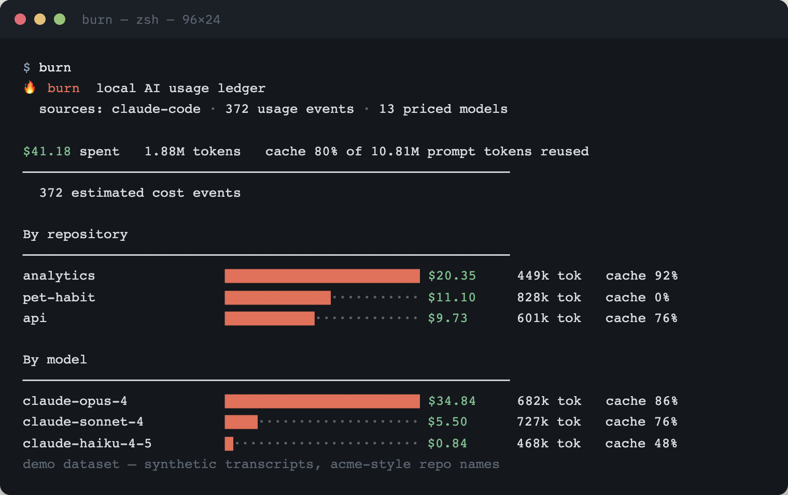
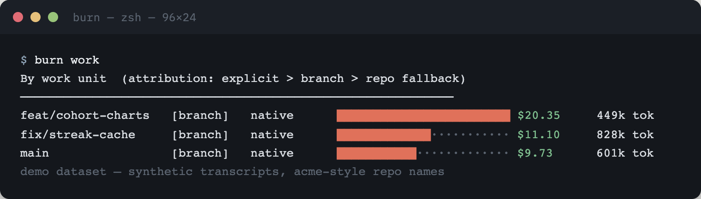
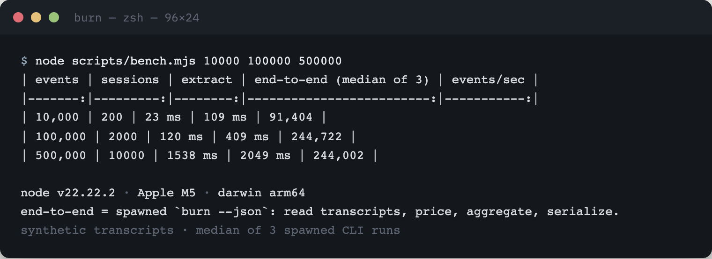

# 🔥 burn

[](https://github.com/aashish254/burn/actions/workflows/test.yml)


**🌐 [Live demo →](https://aashish254.github.io/burn/)**

**Where did your AI budget actually go — and what did each feature cost?**

`burn` is a local, zero-dependency ledger that reads the transcripts your coding
agents already leave on disk. It answers per **repo**, per **model**, per **day**,
per **git branch**: how many tokens you spent, how many dollars that cost, and how
much prompt caching saved you. No network. No account. No telemetry. Nothing
leaves your machine.

The ledger format itself is an open, conformance-tested protocol: **ULP 1.0** —
spec'd at **[github.com/aashish254/ulp](https://github.com/aashish254/ulp)**
(vendored here under [ulp/](ulp/README.md) so one checkout runs both suites).
burn is ULP's reference implementation #1: dashboards and CI can build on the
protocol, not on this CLI.

`burn` — spend per repo, per model, with cache economics:



`burn work` — what each feature/branch actually cost:



*Both shots are real CLI output over a demo dataset of synthetic transcripts;
your own repo names, branches and numbers appear instead.*

## Why

Every coding agent quietly writes down exactly what it did — Claude Code drops a
JSONL transcript per session with a full `usage` block and its git branch;
OpenCode keeps a SQLite db with real billed `cost`; Codex and Gemini CLI record
their own token histories. That data has been sitting on your laptop this whole
time. Nobody adds it up **across agents**, and nobody can tell you what
`feature/payments-refactor` actually cost.

`burn` answers the questions that gate agent adoption at scale:

- Which repo is eating my spend? Which **feature/branch/PR**?
- Am I paying opus prices for 100-token answers? (`burn doctor`)
- What will this pace cost me next month? (`burn forecast`)
- Is this PR over budget *before* it merges? (`burn budget` → exit 3)
- What does my **team** spend, with no backend? (`burn export | merge | team`)

## Install

macOS or Linux with Node ≥ 22.5 (for the built-in `node:sqlite`). One paste:

```bash
curl -fsSL https://raw.githubusercontent.com/aashish254/burn/main/install.sh | bash
```

The [installer](install.sh) verifies the release checksum, installs the CLI
under `~/.burn-cli`, and links the `burn` command into `~/.local/bin`. Nothing
else — no root, no account, no telemetry. Then:

```bash
burn          # your ledger: spend per repo, model, day — across agents
burn work     # dollars per branch / feature / work unit
burn doctor   # is anything wasting money?
```

From source instead:

```bash
git clone https://github.com/aashish254/burn && cd burn && npm link
# or with no linking at all:  node src/cli.js
```

(The `burn-usage` npm package is on the roadmap; until it ships, these are the
two official install routes.)

## How cost is computed (and why we never lie)

`burn` distinguishes **three** kinds of dollar figures and labels its totals with
the mix, so you always know what's real:

| label | meaning | source |
|-------|---------|--------|
| **billed** | the agent recorded the actual charge | OpenCode `session.cost` |
| **estimated** | computed from a pricing **table you control** | tokens × `~/.burn/pricing.json` |
| **unpriced** | tokens counted, dollars **withheld** because the model has no known price | anything not in the table |

If `burn` doesn't know a model's price, it shows tokens and reports `—` for cost.
**It will never fabricate a dollar figure.** The same rule governs every derived
number: forecasts
project only priced events, counterfactuals print `—` for unpriced routes, and the
`supportedAgents` list only contains formats verified against upstream source —
nothing ships claiming an agent it can't truly parse.

```json
// ~/.burn/pricing.json  (USD per 1M tokens)
{ "my-router/llama-4": { "input": 0.2, "output": 0.8, "cacheWrite": 0.2, "cacheRead": 0.05 } }
```

## Performance

A full report over half a million usage events — read transcripts, price,
aggregate, serialize — finishes in about two seconds. Numbers from
[`scripts/bench.mjs`](scripts/bench.mjs) on synthetic transcripts (median of 3
spawned `burn --json` runs, Apple M5, node v22):

| events | extract | end-to-end | events/sec |
|-------:|--------:|-----------:|-----------:|
| 10,000 | 23 ms | 109 ms | 91k |
| 100,000 | 120 ms | 409 ms | 245k |
| 500,000 | 1.54 s | 2.05 s | 244k |



## Commands

```
burn                     overall summary + all breakdowns
burn repos / models / agents / daily / sessions
burn work                cost per work unit: branch ▸ commit-adjacent ▸ repo
burn blame feature/pay   what one branch cost (native attribution)
burn blame v1..HEAD      what a commit range cost (read-only git join)
burn attribute S1 --unit my-epic     charge a session to a named unit
burn sources             which agents were found, where, and with how much data
burn budget --repo app --max 25 [--period day|week|month|all]   exit 3 = over
burn forecast [--window 30]          trend + last-7d-mean, priced events only
burn counterfactual --route claude-haiku-4-5                    estimate-of-estimate
burn doctor              deterministic advice, rules R-1..R-6 (advisory, exit 0)
burn watch               live per-turn cost stream as agents write transcripts
burn export -o me.burn.json          shareable bundle (mergeable, path-scrubbed)
burn export --ulp                    pure ULP 1.0 core document (schema-validated)
burn merge a.json b.json [--audit]   union across machines, recompute-not-sum
burn team a.json b.json              per-human totals (roster.json optional)
burn ingest their.ulp.json [--strict]  accept any conformant ULP ledger
burn ingest dir/                       …or a whole folder of them
burn ingest --list                   what's stored and what each bundle gave
burn conformance                     run the ULP kit (pure JSON vectors; exit 0/2)
burn snapshot                        append today's ledger to ~/.burn/history
burn history ls / history drop F --yes   inspect; delete (only destructive cmd)
burn report [--month 2026-09] [-o sept.md]  markdown digest, safe to commit
burn plan --repo app --budget 50 --months 2  forecast gate: 0 afford / 3 can't
burn attest --month 2026-09          finance one-pager: method, NOT an invoice
burn init --team                     team/usage/ + CI scaffold (git-push-only network)
burn export --otel -o x.otlp.json    OTLP/JSON to a FILE (offline transform)
burn ingest --otel x.otlp.json       OTLP/JSON back in — lossless-or-loud
burn --history / --no-history        fold local snapshots in (default ON for
                                     report, budget month|all, forecast)
burn --since 2026-09-01              only count usage on/after a date
burn --json                          machine-readable (stable schema, additive-only)
```

Exit codes are a contract: `0` report ·
`1` no supported agent data (stderr hint, stdout silent) · `2` error ·
`3` **over budget** — so CI can tell "policy failure" from "tool crash".
`burn` checks budgets and enforces nothing: **burn measures,
[AgentVault](https://github.com/aashish254/agentvault) gates.**

## Supported agents

| agent | store | cost available | status |
|-------|-------|----------------|--------|
| **Claude Code** | `~/.claude/projects/**/*.jsonl` | estimated + git branch | shipped |
| **OpenCode** | `~/.local/share/opencode/opencode.db` | billed (`session.cost`) | shipped |
| **Codex CLI** | `~/.codex/sessions/**/rollout-*.jsonl` | estimated; branch from `session_meta` | shipped |
| **Gemini CLI** | `~/.gemini/tmp/*/chats/*.jsonl` | estimated; repo from workspace dirs | shipped |
| OpenClaw | per-agent SQLite (schema unconfirmed) | billed per message | **held** — we won't guess a format |
| Cursor agent | path TBD | — | planned |

An extractor is one file exporting `label`, `rootPath()`, `available()` and
`extract()` yielding normalized events — see `src/extractors/claude.js`. Run
`burn sources` to see exactly which paths were probed on your machine.

## Teams with zero backend

```bash
# each human:
burn export -o team/usage/ash.json        # git commit it — git IS the sync protocol
# anyone, anywhere:
burn merge team/usage/*.json              # one ledger, deduped by (device, session, index)
burn merge --audit team/usage/*.json      # catches copied ~/.burn/id collisions
burn team  team/usage/*.json              # per-human totals
```

Bundles carry no absolute paths and no hostnames (device ids are random uuids;
hostnames ship as 8-hex hashes). Names appear only from a local `roster.json`.

## Privacy

`burn` opens files under your home directory and prints a summary. It makes **no
network requests** and stores nothing beyond what you explicitly export. Every
dollar is either read from your own agent's records or computed from a pricing
table you wrote. Repo labels are basenames only; exported events are path-scrubbed.

## How this differs from the neighbours

- **vs. `ccusage`** — great, but Claude-only (and Codex-only forks exist). `burn`
  is **cross-agent**, adds the cache-economics view, and separates billed vs.
  estimated dollars so the number is honest.
- **vs. gateways (LiteLLM / OpenRouter / Portkey)** — those meter only traffic that
  *routes through them*. Your native agents bypass them entirely. `burn` meters
  what already happened, with no proxy and no config change.
- **vs. session-migrate** — that moves a session *between* agents. `burn` reads all
  their logs to report *spend*. Different axis; they compose.
- **vs. AgentVault** — AgentVault is the firehose gate for agent traffic; `burn`
  is the measurement layer. `burn budget`'s exit 3 is the seam between them.

## Development

```bash
npm test             # 75 tests, zero dependencies, zero Node warnings:
                     # pricing math, provenance classes, attribution ladder,
                     # reconciliation invariant, read-only git joiner, budget
                     # exit 3, merge idempotence (recompute, never sum), bundle
                     # privacy, doctor fire/no-fire fixtures, snapshot-tested
                     # forecast math, spawned-CLI JSON shape, NO_COLOR, exit
                     # codes, ULP schema + negotiation, ingest integrity, the
                     # conformance kit green in TWO languages (Node + stdlib
                     # Python), snapshot/history tie-breaks, plan gates, the
                     # 400-snapshot perf budget.
```

## Roadmap

- **npm package** — until `burn-usage` ships, the installer and source checkout
  are the official routes.
- **More agents** — Cursor's store once its paths are confirmed; OpenClaw once
  its schema is. We hold a format rather than guess it.
- **A hosted ULP dashboard** — the protocol is designed so dashboards can be
  built by anyone, including people who don't ship a CLI.

The fence around it all: if a feature needs a server or a socket in core, it
does not ship. burn measures; your stack decides.
